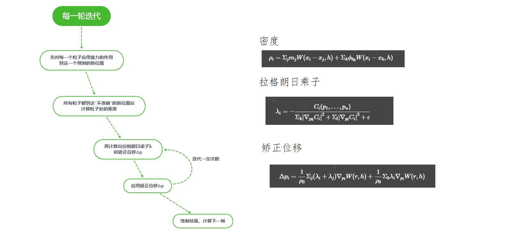

## 关于选题
- 我选择的题目是基于位置的流体模拟(PBF)
## 完成程度
### 我完成的内容
- 将流体模拟为粒子并渲染出来
- 实现了PBF算法的基本框架
### 未完成的内容
- 增加流体的旋度细节
- 重建流体表面并渲染
- 使用加速算法加速寻找每个粒子临近粒子
## 简要流程
- PBF算法将流体看作微小的粒子模拟其运动
- 计算每一帧时 首先根据外力(例如重力)和当前的位置/速度预测一个新的位置
- 将粒子暂时移动到预测位置 计算密度λ
- 根据约束条件(例如液体不可压缩)矫正粒子的运动 得到一个矫正位移Δp
- 迭代一定次数的矫正过程后 将结果作为这一帧的计算结果

## 运行结果

## 代码框架
- 所有代码内容都在main.cpp中
- 请先确保安装OpenGL/GLU/GLUT
- 编译命令 g++ main.cpp -lGL -lglut -lGLU
## 参考资料
- Position Based Fluids(Miles Macklin & Matthias Muller)
- 流体模拟Fluid Simulation:Position Based Fluid(YangWC`s Blog)
- 平时作业的代码框架